# Machine Learning Engineer Nanodegree
## Capstone Project
Yann Dupis  
June 15, 2017

## I. Definition

### Project Overview

With the emergence of both social media and online reviews, sentiment analysis became an important area of research in Machine Learning. Sentiment analysis can help improve products, marketing, [clinical medicine](https://www.ncbi.nlm.nih.gov/pubmed/25982909) or even how cities  [deliver services](http://thegovlab.org/smart-cities-smart-citizens/). Sentiment analysis is a very interesting challenge to work on because the computer needs to interact with human language (natural language processing) and be able to identify and extract subjective information.

Several algorithms like Naive Bayes, Support Vector Machine and Maximum Entropy are commonly used for sentiment analysis. However with the recent development of [recurrent neural networks](http://karpathy.github.io/2015/05/21/rnn-effectiveness/), Deep Learning has started to outperform all the other methods due to its ability to build a representation of whole sentences based on the sentence structure. Several amazing research papers have already been published on this topic by Stanford (e.g. [Sentiment Analysis](https://nlp.stanford.edu/sentiment/])) and OpenAi (e.g. [unsupervised sentiment neuron](https://blog.openai.com/unsupervised-sentiment-neuron/#sentimentneuron])).

For this project, we will perform sentiment analysis on the [Amazon Fine Food Review](https://www.kaggle.com/snap/amazon-fine-food-reviews) dataset from Kaggle.

### Problem Statement

This is a supervised learning problem where we need to predict the positive or negative target variable for each review. The goal will be to maximize the accuracy of this classification.  We will train our model on a dataset containing thousands of reviews presented as unstructured text. Each review will be labeled as positive or negative.

To solve this problem we will perform the following tasks:
  1. Preprocess the data.
  2. Train and tune the hyperparameters of the recurrent neural network.
  3. Test the accuracy of the model on the testing set.


### Metrics

In order to evaluate the model, we will use the F1 score to test accuracy. It considers both precision and recall with the same weight. In the case of fine food reviews, it makes sense to put the same weight on precision and recall. However, in the case of clinical medicine, we might have put more weight on precision. The best F1 score is 1 and the worst is 0.

```math
F1 = 2 * precision*recall / (precision + recall)
```


## II. Analysis

### Data Exploration

The dataset contains 568,454 food reviews Amazon users left from October 1999 to October 2012.

<p align="center">
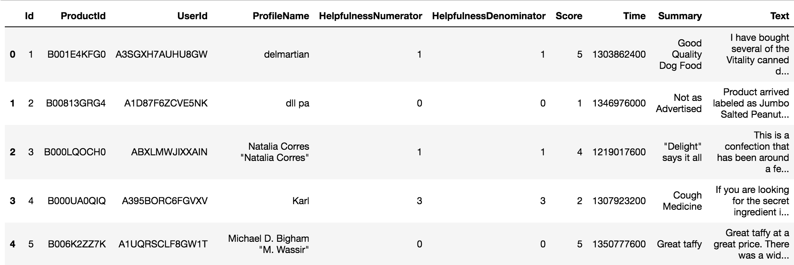
</p>

The review for a specific product by a specific user is stored in the Text column. The Text column consists of an unstructured text. In addition to the Text feature representing the review, we can identify the product using the ProductId feature, the Amazon user with the UserID feature, the date the review was posted by the Time column, and a brief summary of the review with the Summary variable. Additionally, HelpfulnessNumerator and HelpfulnessDenominator, two variables representing how helpful a review is, are also provided in the review.

More importantly, for each review, we have a “Score” variable representing a rating from 1 to 5 (1 is a poor review, and 5 is an excellent review).

### Sentiment Score

Here is the distribution of the score:

<p align="center">
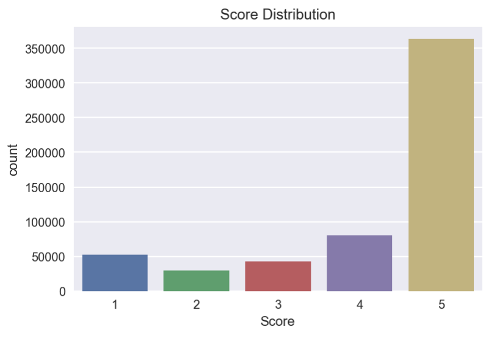
</p>

As we can observe, the majority of Scores are equal to 4 and 5, and with an average score of 4.18. Because of the distribution is very skewed to the left, we will make a binary prediction. We can consider a negative review will have a Score between 1 and 3, and a positive review will have a Score equal to 4 or 5.

After creating a new variable named Sentiment that is set to NEGATIVE when the Score is between 1 and 3, and POSITIVE when the Score is equal to 4 or 5, we get this new distribution:

<p align="center">
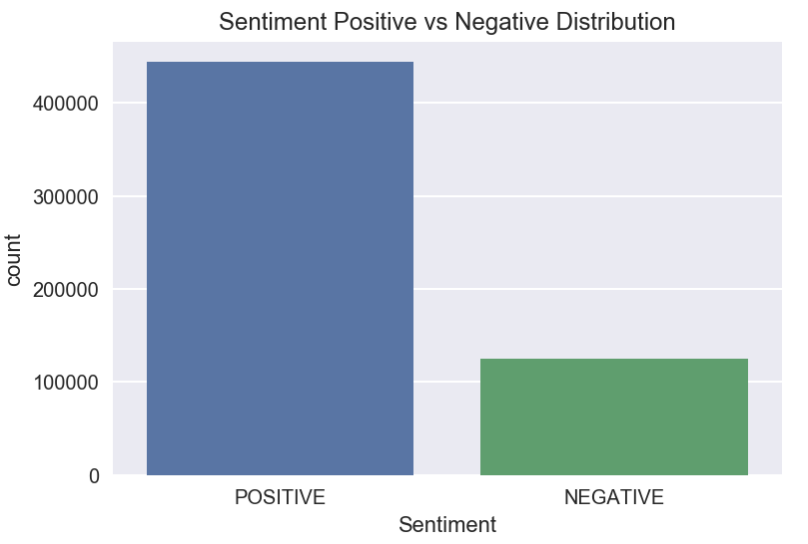
</p>

With this new classification, 78% of fine food reviews are considered positive and 22% of them are considered negative.

### Text Review

Now let's explore our input variable "text" which contains the review of the product.

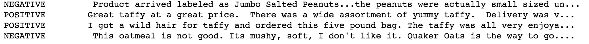

The input variable is an unstructured text. By just looking at the first 90 characters, we can quickly have an idea of whether the review is positive or negative. For the negative reviews, we have negative expressions such as "not good", or "don't like it." These negative expressions can also be more nuanced depending on the context, such as "were actually small sized." For positive reviews, users use positive expression such as "Great taffy", "great price", "wide assortment", "yummy taffy", "very enjoyable," etc.

It's important to note that the text is unstructured, and we will have to do some pre-processing to remove punctuations, transform upper-case to lower case, etc.


### Exploratory Visualization

A common approach to distinguish positive from negative reviews is to look at the frequency of the words. We can imagine that certain words, such as "excellent" or "very tasty," tend to occur more often in positive reviews than negative reviews. Let's see if we can validate this theory.

After calculating the ratio between the frequency count in the positive review divided by the frequency count in the negative review for each word, here are the results:


When the ratio is high (greater than 1), it means than the words tend to occur more often in positive reviews than in negative reviews.

<p align="center">
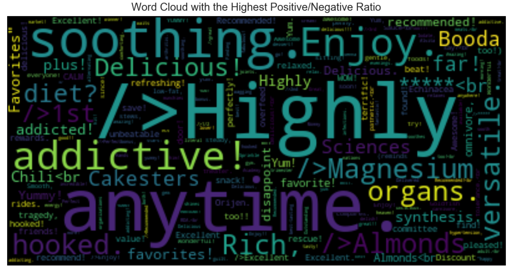
</p>

In the word cloud above, some words that stand out are "highly", "addictive", "soothing", and "enjoy," which have a positive meaning. Certain ingredients or products are also highlighted like "chili", "magnesium", "almonds," etc. These word are neutral, but probably appear often in positive reviews as a result of Amazon's inventory; Amazon likely selects to distribute products, like almonds or chili, that meet or surpass users' expectations.


Let's look now at the words that tend to occur more often in negative reviews than in positive reviews.

<p align="center">
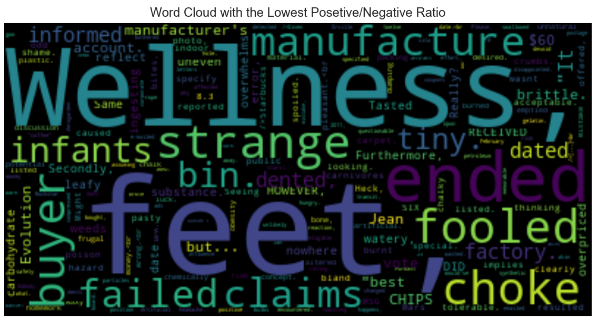
</p>

There are several negative words, such as "strange", "failed", "fooled", and "choke". However it's more difficult to understand why certain words like "wellness," "feet," and "buyer" appear more often in negative reviews.


### Algorithms and Techniques

In order to predict if a review is positive or negative we will use a recurrent neural network. Most of the methods for sentiment analysis look at each word individually, attribute positive points for positive words and negative points for negative words, and then total the points. This is the lexicon approach. However the problem with this method is that it ignores the sequence of the words, which can lead to the loss of important information. The RNN approach can understand subtleties because it doesn’t analyze text at face value. It creates abstract representations of what it learned.

We will use Long Short Term Memory Networks (LSTM), which is a special case of RNN. The main advantage of LSTM is that it can memorize information. When there's too large of a gap between two pieces of information, RNN is unable to learn to connect information. To learn more about LSTM, you can read this excellent  [article](http://colah.github.io/posts/2015-08-Understanding-LSTMs/)  written by Christopher Olah.

I have borrowed the diagram below from the Udacity Deep Learning Nanodegree.

<p align="center">

</p>

#### Embedding
First we will use an embedding layer in order to represent words by a vectors. This representation is more efficient than one-hot encoding, especially in the actual context where the size of the vocabulary is more than 240,000 words.

To generate these embeddings, we will use the word2vec approach, so when words have similar meanings they will be close to each other.

<p align="center">

</p>

The word2vec approach is based on the assumption that similar words happen in similar context. By using this method, we are able to determine some semantic relationships, like, for example, the fact that a man and a king are male, or that a woman and a queen are female.


#### Long Short Term Memory
The next step is to pass the embedded words to the LSTM cells. In the graph, you can observe that there are connections between the first, second and third LSTM cells. In contrast to other models that assume that all the inputs are independent of each other, these connections here allow us to pass information contained in the sequence of words. One of the strengths of the LSTM cell is the ability to add or remove information to the cell state.


#### Output: positive or negative?
Finally, we will predict if the review is positive or negative using the sigmoid function. The advantage of the function is that it's bound between 0 and 1 and can be interpreted as a probability of success. For example, we can estimate the probability that a review is positive. At each step, we have an output. However, we only care about the final output that predicts the sentiment at the end of the sentence.

#### Tuning hyperparameters

For our recurrent neural network we will have to tune the following hyperparameters:

Optimizer hyperparameters:
  - Learning rate
  - Minibatch size
  - Number of epochs

Model hyperparameters:
  - Number of hidden layers (LSTM layers)
  - Number of units in the LSTM cells
  - Dropout rate


### Benchmark

To benchmark our model, we could compare the result of our model to the solutions provided by other Kagglers on the Kaggle forums.
For example, Guillaume Payen was able to achieve an F1 score of 0.92 using a traditional approach like Naive Bayes and logistic regression model. You can find his notebook [here](https://www.kaggle.com/gpayen/building-a-prediction-model).


## III. Methodology

### Data Preprocessing

In order to train our model, we had to transform the reviews into the right format. We performed the following steps:

- Remove punctuations.
- Transform all the characters into lower case.
- Transform each review into a list of integers:
    - First create a dictionary to map each word contained in vocabulary of the reviews to an integer.
    - Then transform each review into a list of integers using the dictionary previously created.
- Create an array with 200 columns, and enough rows to fit one review per row.
- Then store each review consisting of integers in the array. If the number of words in the review is less than 200 words, we can pad the list with extra zeros. If the number of words in the review are more than 200 words then we can limit the review to the first 200 words.

If we don't limit the review to 200 words, it will take too much time for the RNN to train. Here is the distribution of the review length:

<p align="center">
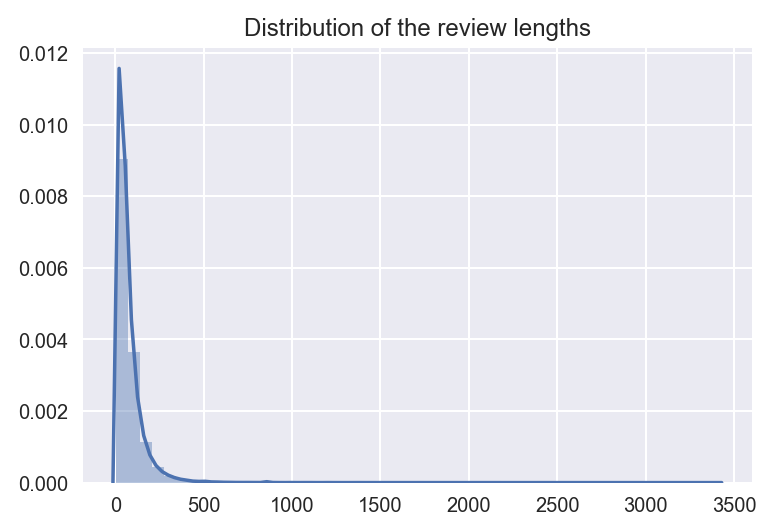
</p>

The mean and the third quartile of the review length is equal to 79 and 97, respectively.  Therefore if we limit the review length to 200 words, we shouldn't lose too much information.

### Implementation

#### Split the dataset into a training, testing and a validation dataset
In order to train our RNN model and evaluate it, it’s important to split the data into training, validation and testing datasets. We will train the model on a training set, and tune the model by validating the results on the validation dataset. Finally we will measure the ability of our model to generalize by testing our model on the testing dataset.

#### Build the neural network with Tensorflow
The next step is to build the recurrent neural network using the popular deep learning framework, Tensorflow.

To feed input, labels and keep_prob data into Tensorflow we need to first create placeholders.
```python
inputs_ = tf.placeholder(tf.int32,[None, None],name='inputs_')
labels_ = tf.placeholder(tf.int32,[None, None],name='labels_')
keep_prob = tf.placeholder(tf.float32,name='keep_prob')
```

Once we send the input data (the reviews) to Tensorflow, we want to transform each integer representing a word into a vector. As mentioned earlier, this method is called embedding.

```python
embedding = tf.Variable(tf.random_normal((n_words,embed_size),-1,1),name='embedding_')
embed = tf.nn.embedding_lookup(embedding,inputs_)
```

Then we need to create our LSTM cells and specify the number of hidden units in the LSTM cell.
```python
lstm = tf.contrib.rnn.BasicLSTMCell(lstm_size)
```

It's always a good practice to add a Dropout layer to prevent the model from overfitting on the training set.
```python
drop = tf.contrib.rnn.DropoutWrapper(lstm,output_keep_prob=keep_prob)
```
By using tf.contrib.rnn.MultiRNNCell we can stack multiple LSTM layers. Usually in deep learning, the more hidden layers you have, the better the prediction will be.
```python
cell = tf.contrib.rnn.MultiRNNCell([drop]*lstm_layer*)
```

We initialize all the states to zero.
```python
initial_state = cell.zero_state(batch_size, tf.float32)
```

Then we want to pass the input data through the LSTM cells. The output of each LSTM cell is carried to the next LSTM cell. This mechanism allow the recurrent neural network to memorize information.
```python
outputs, final_state = tf.nn.dynamic_rnn(cell, embed, initial_state=initial_state)
```

To get our prediction, we use a fully connected layer with a sigmoid function.
```python
predictions = tf.contrib.layers.fully_connected(outputs[:, -1], 1,
                                                        activation_fn=tf.sigmoid,
                                                        weights_initializer=
                                                        tf.truncated_normal_initializer(stddev=0.1))
```

To measure the accuracy of our neural network, we need to define the cost function. For this problem, we will use the mean squared error.
```python
cost = tf.losses.mean_squared_error(labels_, predictions)
```
Finally, we want to minimize our cost function in order to make our network output as close as possible to the target values. For this project, we will use the Adam optimizer.
```python
optimizer = tf.train.AdamOptimizer(learning_rate).minimize(cost)
```

The graph below created with Tensorboard illustrates the recurrent neural network built above.

<p align="center">

</p>

#### Model Training
The next step will be to train our model. We will use the stochastic gradient descent approach. This method consists of calculating an estimate of the cost function on small batches of the dataset. This approach is more scalable than a traditional gradient descent.

If the model is learning, we should observe a decrease of the cost function and an increase of the model accuracy on the validation set for each minibatch.

### Refinement

In order to refine our model, we have used Tensorboard extensively.

#### Vocabulary reduction

We have tried different approaches of vocabulary reduction in order to reduce the noise in the data, such as removing stop words, or removing words based on minimum frequency or polarity. Unfortunately none of these approaches helped the RNN converge faster, as we can see the graph below. We are looking at the cost with and without vocabulary reduction by number of iterations.

<p align="left">
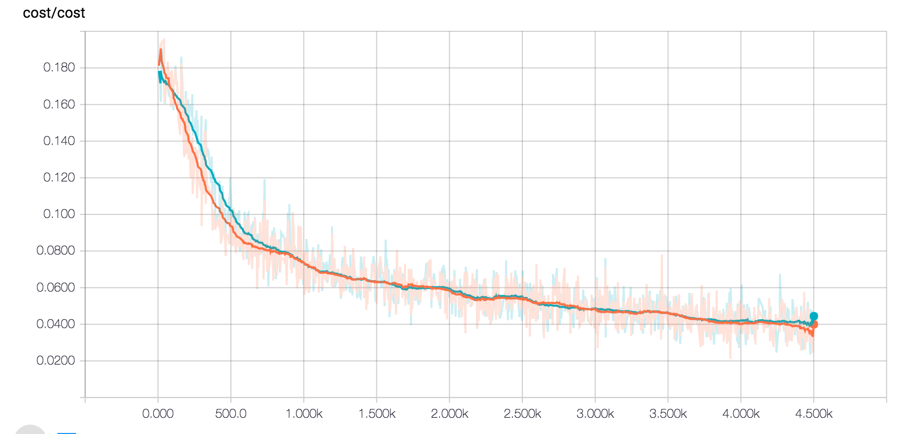

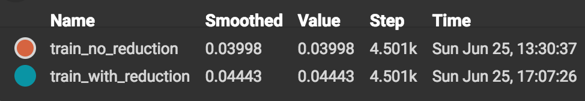
</p>

#### Number of layers and LSTM size.

In the graph below we are comparing the cost per number of iterations for a variety of RNN architecture (a combinations of number of layers and LSTM size). We can observe that the cost doesn't decrease with an LSTM size equal to 512. We are probably not able to converge because there are too many weights in RNN that need to be adjusted during the backpropagation of the error. For this reason, we will exclude the option to use an LSTM layer of size 512.


<p align="left">
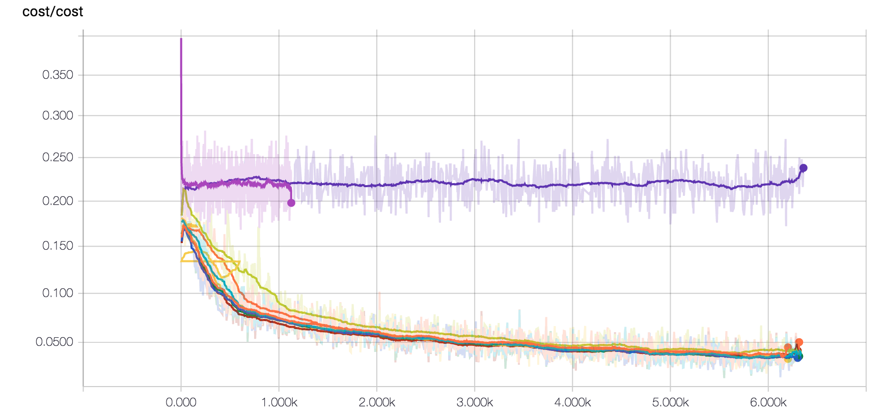

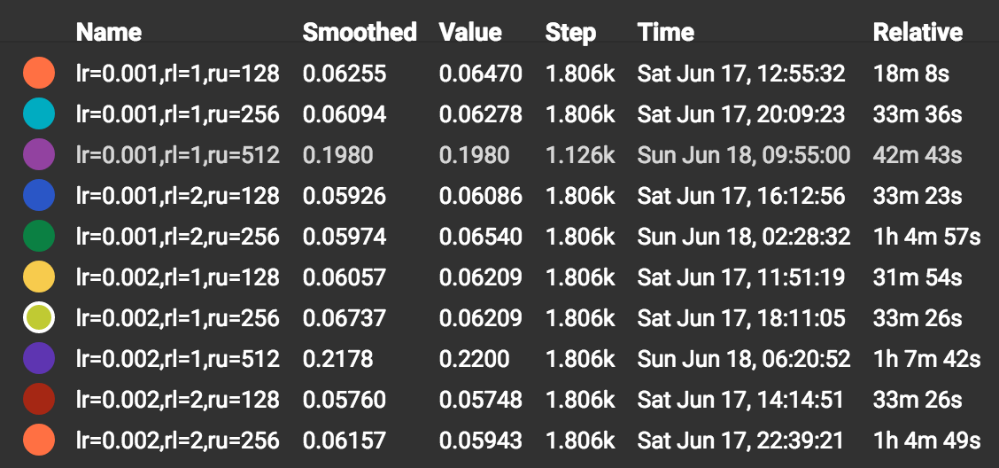
</p>

Secondly, it seems that when the learning rate is equal to 0.002, the decrease of the cost by iteration tends to be more hectic. It's an indication that we should decrease the learning rate.

<p align="left">
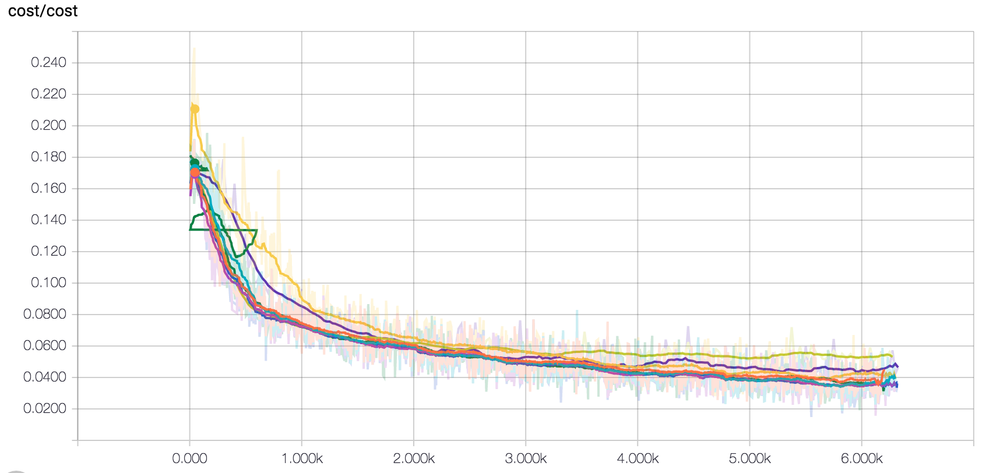

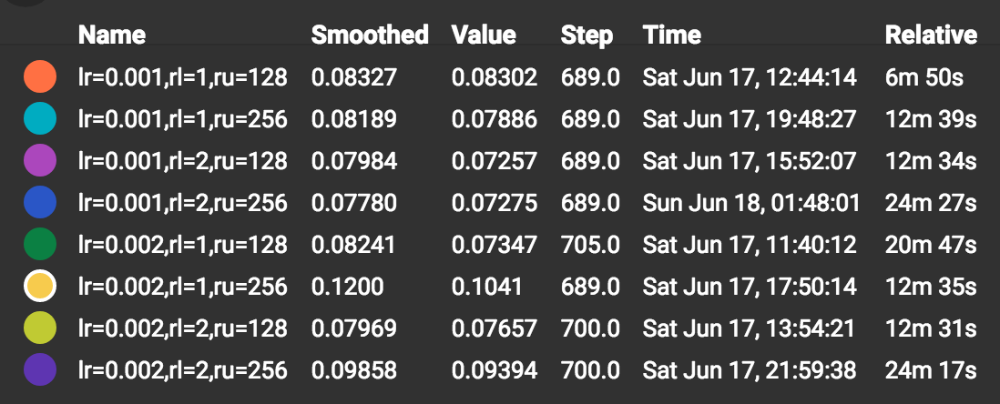
</p>

When the learning rate is set to 0.001, the decrease is more smooth.
<p align="left">


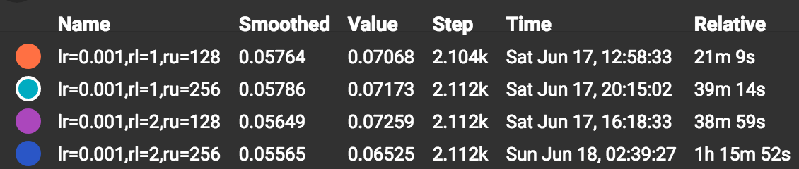
</p>

If we look more closely at the cost for an iteration greater than 4000, the cost tends to be higher with one layer and an LSTM size of 128 units. So we can discard this architecture.  
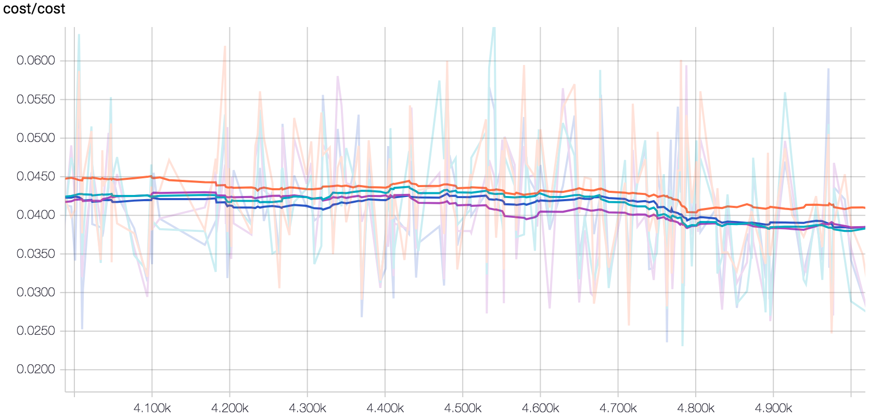

The remaining architectures have the same cost. However, when we compare the relative time, it takes much more time if we have an LSTM size equal to 256 and 2 layers.

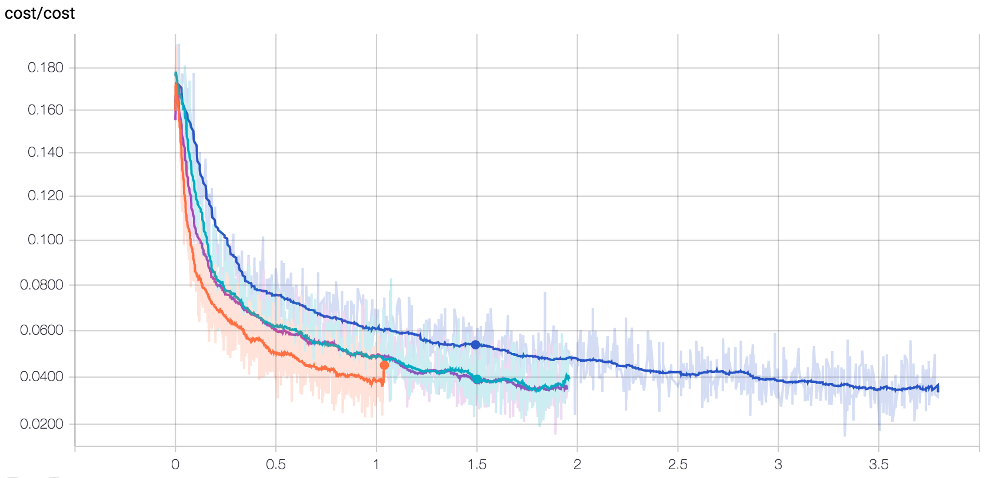

In conclusion, we see similar performances when we have a single layer with an LSTM size of 256 units, and an RNN with two layers and 128 units.


#### Dropout layer

Usually a dropout layer prevents the model from overfitting on the training set. In the case of our model, it seems that the dropout layer doesn't have much effect. At least the good news is that the cost on the testing set doesn't increase if we train our model with too many epochs. This means that our model is able to generalize.
In the graph below, we are comparing the cost on the training and testing sets both with and without a dropout layer with a probability of 0.5.

<p align="left">
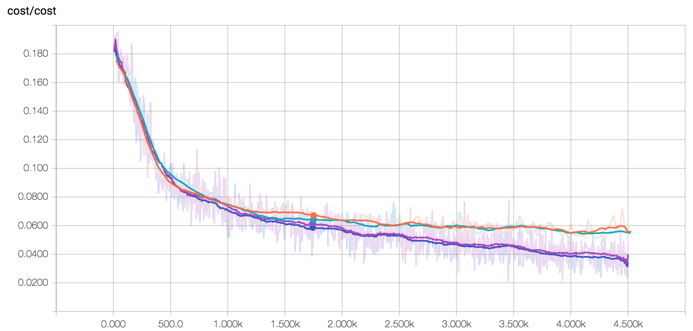

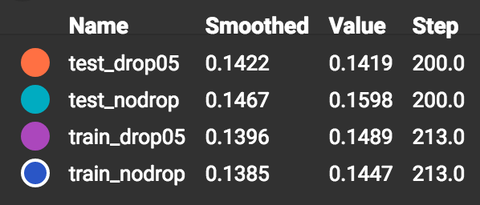
</p>

## IV. Results

### Model Evaluation and Validation

Based on the observation above for our final model, we have decided to include all the vocabulary, have a single LSTM layer, an LSTM size of 256, and a dropout layer with a probability of 0.5.

The best way to see if our model is able to generalize is to test our model on the untouched testing set. In order to measure the performance of the binary classifier, we can plot the [ROC curve](https://en.wikipedia.org/wiki/Receiver_operating_characteristic). The ROC curve consists of plotting the true positive rate against the false positive rate. The best scenario is when the curve matches the left corner. This would mean that we are able to achieve 100% sensitivity (no false negatives) and 100% specificity (no false positives).

<p align="center">
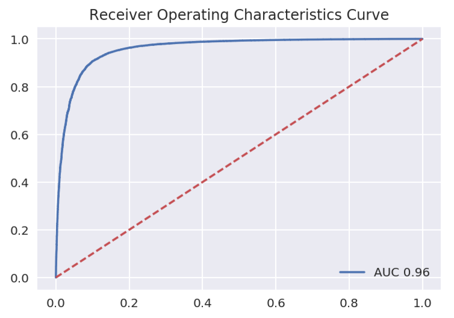
</p>

We can observe that the area under the curve (AUC) is equal to 0.96. Knowing that the maximum AUC score is equal to 1, we can conclude that our model does a pretty good job at making accurate predictions on unseen reviews. Moreover our model seems to be very balanced in terms of false positive rate vs false negative rate.


The other important metric is the F1 score, because it also takes into consideration, precision and recall. In our original dataset 78% of the reviews were positive. If we would use a naive algorithm and predict that all the reviews are positive, our accuracy would be 78%. This is why we should use the F1 score in order to measure the performance of our RNN.

<p align="center">

</p>

The final F1 score is equal to 0.92. The precision and recall are also equal to 0.92. It means once again that our model has a good balance between sensitivity and specificity. There is room for improvement but our RNN model has learned to distinguish negative fine food reviews from positive reviews.


### Justification

If we compare the performance of our RNN and the benchmark, we can observe that they are very similar. However our model was based on the review input variable and the benchmark was based on the summary variable. Even if the reviews were very detailed with vocabulary specific to the products, the RNN is able to identify relevant information to determine if these are positive or negative reviews with an F1 score of 0.92.

With such performance, we could definitely use this algorithm to identify if fine food reviews are positive or negative.


## V. Conclusion

### Reflection

With this project, we were able to demonstrate that we can use RNN to predict sentiments. Once again, the strength of the RNN is that it's able to take into consideration the entire sequence of words, which help the model find nuances.
The main challenge of using a deep learning approach is that it's very expensive in terms of computing and time. To train this network we had to use GPUs provided by the platform [FloydHub](https://www.floydhub.com). Even with GPUs, it takes at least 1.5 hours to train our model. It was definitely a challenge to build our model and tune the hyperparameters correctly .

### Improvement

Deep Learning techniques tend to outperform every other algorithm when we get access to lots of data. So if we could train our model on a larger dataset, the model should definitely improve. With RNN, the model creates it's own representation of the sentence. The reviews contain vocabulary specific to the food product. If we had mode data, our model should be able to identify the specific characteristics that make a good product.
In order to improve this model, we should also investigate if we could include the product name/product type. If we had this information maybe our RNN would be able to more easily identify the important characteristics for each product.


-----------

### Resources

https://www.udacity.com/course/deep-learning-nanodegree-foundation--nd101

https://www.tensorflow.org/tutorials/word2vec
